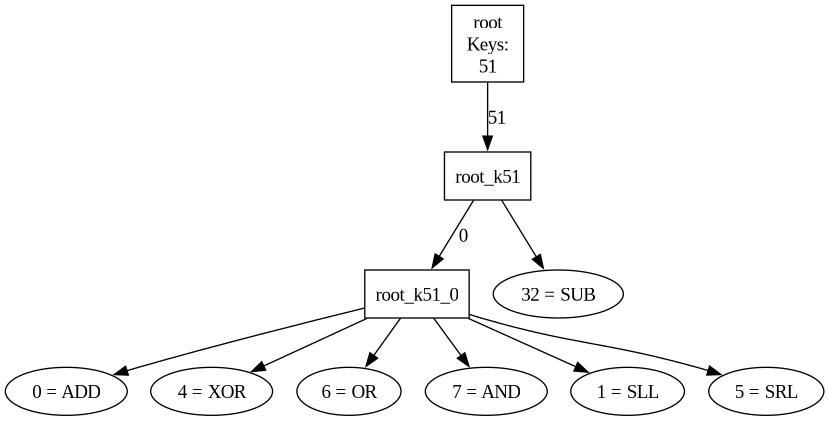
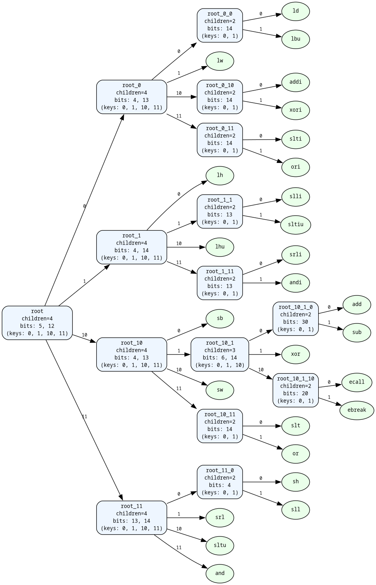
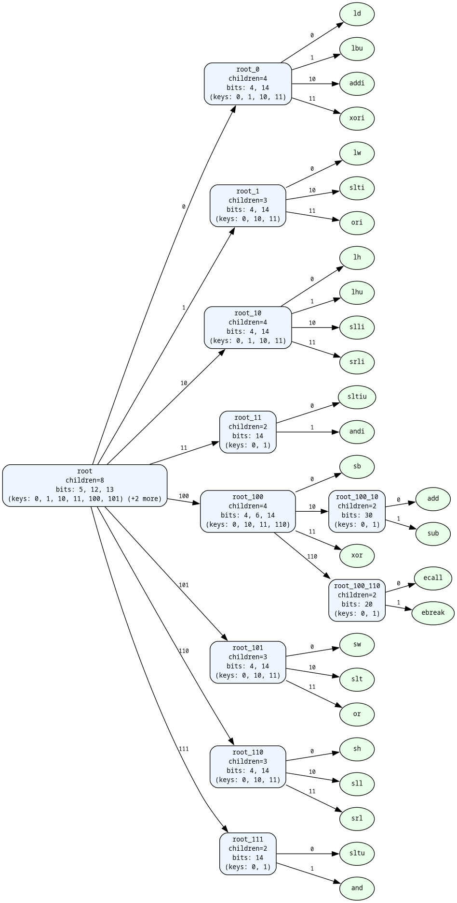
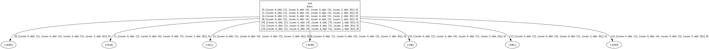
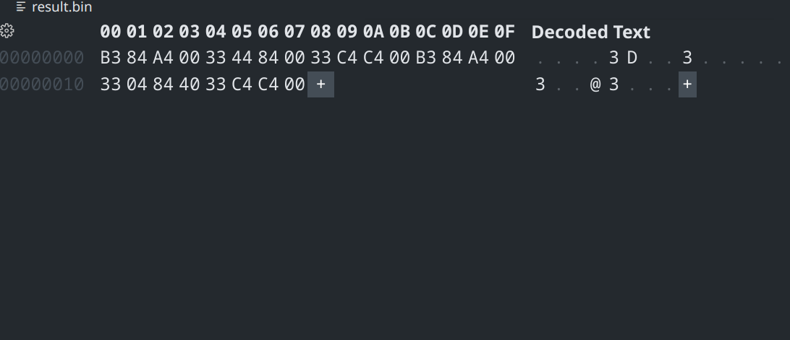

# ProtDSL

[](LICENSE)
[](https://github.com/Barkir/ProtDSL)
[](https://github.com/Barkir/ProtDSL/commits/main)


> A domain-specific language (DSL) for describing CPU instructions and automatically generating encoders, decoders, and simulators with RISC-V RV32I

[(older readme version)](./docs/README.md)

## Encoder Generator
- SimInfra generates a `.yaml` file with command specification (information to generate encoder and decoder)

<details>
<summary>
add instruction specification example
</summary>

```ruby
#<struct SimInfra::InstructionInfo name=:ADD, fields=[#<struct SimInfra::Field name=:rd, from=11, to=7, value=:reg>, #<struct SimInfra::Field name=:rs1, from=19, to=15, value=:reg>, #<struct SimInfra::Field name=:rs2, from=24, to=20, value=:reg>, #<struct SimInfra::Field name=:opcode, from=6, to=0, value=51>, #<struct SimInfra::Field name=:funct7, from=31, to=25, value=0>, #<struct SimInfra::Field name=:funct3, from=14, to=12, value=0>], format=:R, code=#<SimInfra::Scope:0x00007f6070021bd8 @tree=[#<struct SimInfra::IrStmt name=:new_var, oprnds=[rd:i32 (72)], attrs=nil>, #<struct SimInfra::IrStmt name=:new_var, oprnds=[rs1:i32 (72)], attrs=nil>, #<struct SimInfra::IrStmt name=:getreg, oprnds=[:rs1, #<SimInfra::XReg:0x00007f6070022628 @name=:rs1>], attrs=nil>, #<struct SimInfra::IrStmt name=:new_var, oprnds=[rs2:i32 (72)], attrs=nil>, #<struct SimInfra::IrStmt name=:getreg, oprnds=[:rs2, #<SimInfra::XReg:0x00007f6070022600 @name=:rs2>], attrs=nil>, #<struct SimInfra::IrStmt name=:new_var, oprnds=[_tmp0:i32 (72)], attrs=nil>, #<struct SimInfra::IrStmt name=:add, oprnds=[_tmp0:i32 (72), rs1:i32 (72), rs2:i32 (72)], attrs=nil>, #<struct SimInfra::IrStmt name=:let, oprnds=[rd:i32 (72), _tmp0:i32 (72)], attrs=nil>, #<struct SimInfra::IrStmt name=:setreg, oprnds=[#<SimInfra::XReg:0x00007f6070022678 @name=:rd>, :rd], attrs=nil>], @vars={rd: rd:i32 (72), rs1: rs1:i32 (72), rs2: rs2:i32 (72), _tmp0: _tmp0:i32 (72)}>, args=[#<SimInfra::XReg:0x00007f6070022678 @name=:rd>, #<SimInfra::XReg:0x00007f6070022628 @name=:rs1>, #<SimInfra::XReg:0x00007f6070022600 @name=:rs2>], asm="ADD rd, rs1, rs2">
```

</details>

#### Desribing the process of encoding

##### 1. Generating a header
```ruby
    def self.write_encoder_header(encoder)
        encoder.write(CLASS_MICROASM)
        encoder.write(INITIALIZE_CODE)
        encoder.write(PROG_CODE)
        encoder.write(SET_BITS_CODE)
        encoder.write(SAVE_BINARY_CODE)
        encoder.write(RUN_BINARY_CODE)
        encoder.write(WRITE_COMMAND_CODE)
        encoder.write(LABEL_CODE)
        encoder.write(SKIP_IF_COLLECT_CODE)
    end
```
In future it is going to be a standard library where all the _helper_ methods of encoder are defined, but now it is a header.


##### 2. Generating translation function
```ruby
def self.create_translate_func(encoder, instr)
        encoder.write("def translate#{instr.name.to_s}(#{OPERANDS_ARRAY})\n")
        encoder.write("\tcommand = 0\n")
        instr.fields.each_with_index do |elem, index|
            encoder.write("\t#{elem.name}=#{OPERANDS_ARRAY}[#{index}]\n")
            encoder.write("\tcommand = set_bits(command, #{elem.name}, #{elem.from}, #{elem.to})\n")
        end
        encoder.write(END_TERM)
    end
```

#### 3. Result
```ruby
def translateADD(operands)
	command = 0
	rd=operands[0]
	command = set_bits(command, rd, 11, 7)
	rs1=operands[1]
	command = set_bits(command, rs1, 19, 15)
	rs2=operands[2]
	command = set_bits(command, rs2, 24, 20)
	opcode=operands[3]
	command = set_bits(command, opcode, 6, 0)
	funct7=operands[4]
	command = set_bits(command, funct7, 31, 25)
	funct3=operands[5]
	command = set_bits(command, funct3, 14, 12)
end
```

As the result we generate functions for all instructions and a `byte-code` file generated at the end.


##### Translation examples
| ASM | Byte-code |
|-----|-----------|
| ADD r8, r8, r8    | `C0 0C 00 00`|

### Decoder Tree && Decoder

The task is to write an effective decoder based on building a decoding tree. For now I finished generating a decoder tree based on the **fields** of the instructions such as: _opcode_, _funct7_, _funct3_.

| Algo Description | Description |
|------------------|-------------|
|	first implementation based on decoding individual fields. 3 levels| |
| second implementation - **scoring algorithm** (bit_basis_length=2). 3 levels | 
| second implementaion (bit_basis_length=3). 2 levels. | |
| second implementation (bit_basis_length=4) 1 level|  |

### How to decode a program on RISCV IM32 Architecture using my decoder?

1. Encode it using encoder - `ruby add_sub.rb`
2. run `generate_decoder_binary.sh`
3. run `riscv_decode result.bin`

### How is it actually generated?
    The whole decoding pipeline can be seen in base.rb in Decoder section, here I explain important moments

1. We have a function `create_decoder`
    - write a header (important functions and structures in C++ decoding engine)
    - create a decoder tree
    - create `execute functions` for every instructions in the .yaml where all the semantics, registers and other metainfo described.

2. We have a class called `DecoderDSL` where we can easily define basic operations such as `add`, `getreg` and generate them as a C++ code.

<details>
<summary>
DecoderDSL code example
</summary>

```ruby
        self.add_instruction :getreg do |irstmt, operands|
            reg_to_load = operands[irstmt.oprnds[0].to_s]
            reg_to_get = operands[irstmt.oprnds[1].to_s]
            "\t#{reg_to_load.name} = spu.regs[getField(command, #{reg_to_get.to}, #{reg_to_get.from}, #{create_mask(reg_to_get.to, reg_to_get.from)})];\n
            \t#{reg_to_load.name}_name = getField(command, #{reg_to_get.to}, #{reg_to_get.from}, #{create_mask(reg_to_get.to, reg_to_get.from)});\n"
        end

        self.add_instruction :setreg do |irstmt, operands|
            reg_to_load = operands[irstmt.oprnds[0].to_s]
            reg_to_get  = operands[irstmt.oprnds[1].to_s]
            "\tspu.regs[getField(command, #{reg_to_load.to}, #{reg_to_load.from}, #{create_mask(reg_to_load.to, reg_to_load.from)})] = #{reg_to_get.name};\n"
        end

```

</details>

3. We have a function `create_init` where we recursively generate a `switch of switches` based on **decoder tree** we've built on previous stage.

<details>
<summary>
Generated switch example
</summary>


```c++
	switch(field_level2) {
		case 51:
		{
			int field_level3 = getField(command, 25, 31, 0b00000000000000000000000001111111);
			switch(field_level3) {
			case 0:
			{
				int field_level4 = getField(command, 12, 14, 0b00000000000000000000000000000111);
				switch(field_level4) {
				case 0:
				{
				executeADD(spu, command);
				break;}
				case 4:
				{
				executeXOR(spu, command);
				break;}
				case 6:
				{
				executeOR(spu, command);
				break;}
				case 7:
				{
				executeAND(spu, command);
				break;}
				case 1:
				{
				executeSLL(spu, command);
				break;}
				case 5:
				{
				executeSRL(spu, command);
				break;}
				}
			break;}
			case 32:
			{
			executeSUB(spu, command);
			break;}
			}
		break;}
		}
	}

```

</details>

4. There also some details like `incrementing pc`, or `writing logs`, but basically that's all about making a decoder generator.

### Decoder usecase example.

We have this mircoassmbler code example

```ruby
require_relative "../encoder"

asm = MicroAsm.new
asm.prog do
    ADD r9, r9, r10
    XOR r8, r8, r8
    XOR r8, r9, r12
    ADD r9, r9, r10
    SUB r8, r8, r8
    XOR r8, r9, r12
end

```

- running `ruby add_sub.rb`
- `result.bin` is generated which looks like this (6 4-byte commands)

- running `ricsv_decode result.bin` and getting this
```
ADD      rd=-1    rs1=9    rs2=10:         a484b3
XOR      rd=-1    rs1=8    rs2=8:          844433
XOR      rd=-1    rs1=9    rs2=12:         c4c433
ADD      rd=-1    rs1=9    rs2=10:         a484b3
SUB      rd=-1    rs1=8    rs2=8:          40840433
XOR      rd=-1    rs1=9    rs2=12:         c4c433
```

The dump shows us _command name_, _use of registers_ and _command in hex_
